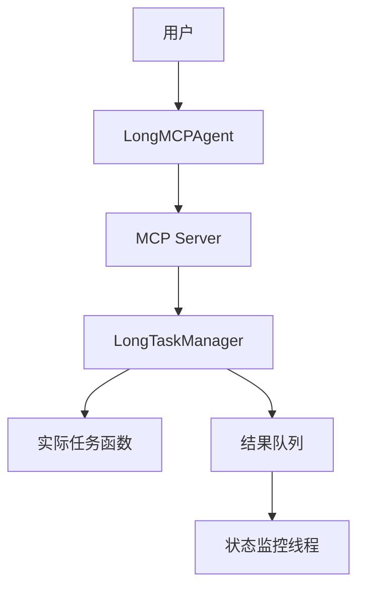

# 智能体与MCP远程工具实现长时间运行任务的智能执行与管理查询

本文档详细解析了`LongMCPAgent`智能体如何与MCP（Model Context Protocol）远程工具协同工作，实现长时间运行任务的智能执行与管理查询。该系统基于OpenDrSai框架，结合了`examples/agent_groupchat/groupchat_task_LongTask/groupchat_task/Long_MCP_Agent.py`和`examples/tools/MCP_Long_task/long_task_MCP.py`两个核心组件。

## 1. 系统架构概览

整个系统由三个主要部分构成：

1. **智能体层** (`LongMCPAgent`): 负责接收用户请求、调用远程工具、处理响应并管理对话流。
2. **MCP服务层** (`long_task_MCP.py`): 提供具体的远程工具实现，负责执行耗时操作和任务状态管理。
3. **任务管理层** (`LongTaskManager`): 核心的异步任务调度器，使用多进程机制来安全地执行长时间运行的任务。



## 2. 长时间任务执行流程

### 2.1 任务提交阶段

当用户向`LongMCPAgent`提出一个需要长时间处理的请求时（例如"请进行一项深度研究"），智能体会通过MCP协议调用远程工具`search_google`。

在`long_task_MCP.py`中，`search_google`工具的定义如下：

```python
@mcp.tool()
async def search_google(
    keywords: list[str],
):
    task_id = str(uuid4())
    result = task_manager.run_sync_task(
        func=search_google_demo_sync, 
        task_id=task_id, 
        keywords=keywords
        )
    return result
```

- `task_manager`是`LongTaskManager`的一个实例。
- `run_sync_task`方法被调用来启动一个同步的长任务。
- 系统会为本次任务生成一个唯一的`task_id`。

### 2.2 任务管理器工作原理

`LongTaskManager`是实现非阻塞执行的关键。其工作流程如下：

1. **任务检查**: 在创建新任务前，先检查`task_id_to_result`字典，看是否已有相同ID的任务结果。如果有，则直接返回缓存结果。
2. **并发限制**: 检查当前正在运行的任务数是否超过`_task_limit`（默认为2）。如果达到上限，则拒绝新任务。
3. **进程创建**: 使用`multiprocessing.Process`创建一个独立的子进程来执行实际的任务函数（如`search_google_demo_sync`）。
4. **超时控制**: 主线程会等待`time_limit`秒（默认10秒）。在这段时间内，如果任务完成，结果会被放入`result_queue`；否则，主线程将返回`IN_PROGRESS`状态给智能体。
5. **后台监控**: 一个名为`queue_monitor_worker`的守护线程会持续监听`result_queue`，一旦有结果到达，就将其更新到`task_id_to_result`字典中，供后续查询。

### 2.3 智能体响应

由于任务执行时间超过了`time_limit`，`run_sync_task`会返回一个包含`IN_PROGRESS`状态的JSON对象：

```json
{
  "id": "6ee56087-d6a0-46a7-9509-e13b721f9598",
  "status": "IN_PROGRESS",
  "result": "Task is still running",
  "message": "Task is still running after 10s. Use the same task_id to check status."
}
```

`LongMCPAgent`接收到此响应后，在`_process_model_result`方法中会识别出`IN_PROGRESS`状态，并构造一个`AgentLongTaskMessage`发送给用户：

> "perform_long_research is running. Please wait for the result."

同时，它会保存`task_id`和调用参数，以便后续查询。

## 3. 任务状态管理与查询

### 3.1 自动轮询（可选）

虽然示例代码中没有实现自动轮询，但`LongMCPAgent`具备了实现此功能的基础。理论上，智能体可以在返回`IN_PROGRESS`状态后，启动一个后台协程，定期调用`query_research_status`工具来检查任务进度，并在任务完成后主动通知用户。

### 3.2 手动查询机制

当前实现采用了更简单的手动查询模式。用户可以随时发起一个新的查询请求，询问特定任务的进度。

这通过调用`query_research_status`工具实现：

```python
@mcp.tool()
async def query_research_status(
    task_id: str,
):
    result = task_manager.get_task_status(task_id)
    return result
```

`get_task_status`方法的逻辑如下：

1. **检查已完成任务**: 首先在`task_id_to_result`中查找，如果存在且状态为`DONE`或`ERROR`，则返回最终结果，并清理资源。
2. **检查进行中任务**: 如果在`task_id_to_task`中找到任务记录，则返回`IN_PROGRESS`状态及已耗时信息。
3. **处理未找到任务**: 如果两者都找不到，则返回`ERROR`状态，提示"Task not found"。

在`LongMCPAgent`中，`_process_long_task_query`方法专门处理此类查询：

```python
async def _process_long_task_query(
        self,
        task: Dict|LongTaskQueryMessage|Sequence[BaseChatMessage] | None = None,
        cancellation_token: CancellationToken | None = None,
    )-> AsyncGenerator[BaseAgentEvent | BaseChatMessage | Response, None]:
    
    if not isinstance(task, LongTaskQueryMessage):
        raise ValueError("tasks must be a LongTaskQueryMessage")
    
    query_arguments: Dict = task.query_arguments
    query_tool_name = task.tool_name
    
    # 调用MCP工具查询状态
    result = await self._workbench.call_tool(
            name = query_tool_name,
            arguments=query_arguments)
    result_json = json.loads(result.result[0].content)

    if result_json["status"] == "IN_PROGRESS":
        yield Response(
            chat_message=AgentLongTaskMessage(
                source=self.name,
                content=result_json["result"],
                task_status=TaskStatus.in_progress.value,
                query_arguments=query_arguments,
                tool_name=query_tool_name
            ))
    else:
        yield Response(
            chat_message=TextMessage(
                    source=self.name,
                    content=result_json["result"],
                ))
```

## 4. 关键设计特点

### 4.1 异步与非阻塞

整个系统设计确保了智能体的核心循环不会被长时间任务阻塞。即使任务需要几分钟甚至几小时，智能体也能立即响应，保持对话的流畅性。

### 4.2 多进程安全

使用`multiprocessing`而非`threading`来执行长任务，避免了Python的GIL（全局解释器锁）问题，并能真正利用多核CPU进行计算密集型任务。

### 4.3 状态持久化

虽然状态存储在内存字典中，但通过`task_id`实现了跨请求的状态关联。用户可以在不同时间点使用相同的`task_id`来查询同一个任务的进度。

### 4.4 资源清理

系统内置了资源清理机制。一旦任务完成（成功或失败），相关的进程和内存引用都会被及时释放，防止资源泄漏。

## 5. 总结

该方案成功地将长时间运行的任务从智能体的实时对话流中解耦出来。通过MCP协议作为桥梁，`LongMCPAgent`能够优雅地处理耗时操作，提供即时反馈，并支持灵活的任务状态查询，为构建专业的科学智能体系统提供了坚实的基础。